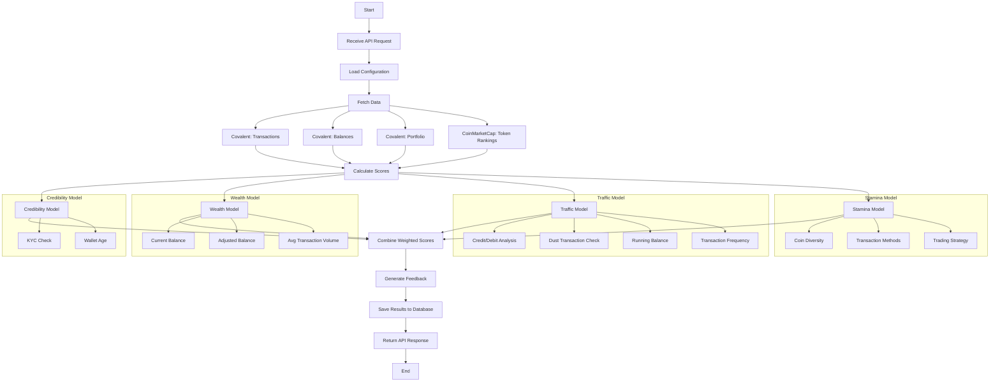

Configuration File:
The config.json file contains various parameters used in the scoring system:


score_range: Defines the range of possible scores.
qualitative_range: Maps score ranges to qualitative descriptions.
thresholds: Defines minimum requirements for certain metrics.
params: Contains various parameters used in scoring calculations.
scores: Defines the weights for different models and metrics within those models.


Scoring Models:
The system uses four main models to calculate the overall score:

a) Credibility (10% weight):

KYC (30%)
Inception (70%)

b) Wealth (33% weight):

Capital Now (25%)
Capital Now Adjusted (55%)
Volume per Transaction (20%)

c) Traffic (37% weight):

Credit (14%)
Debit (14%)
Dust (14%)
Run Balance (40%)
Frequency (18%)

d) Stamina (20% weight):

Coins (50%)
Methods (45%)
Dexterity (5%)


Scoring Process:
The main scoring function is covalent_score in the score.py file. It calls various helper functions to calculate scores for each model:

a) Credibility:

Checks if the wallet is verified (KYC).
Calculates the wallet's age (inception).

b) Wealth:

Calculates the current total balance.
Adjusts the balance based on the ranking of owned tokens.
Computes the average volume per transaction.

c) Traffic:

Analyzes credit and debit transactions.
Checks for "dust" transactions (very small amounts).
Calculates the running balance over time.
Determines transaction frequency.

d) Stamina:

Counts the number of different cryptocurrencies owned.
Analyzes the different transaction methods used.
Evaluates the user's trading strategy (buying low, selling high).


Scoring Calculation:
For each model and metric, the system uses the parameters defined in the config file to map raw values to scores. It often uses numpy's digitize function to bin values and assign scores based on predefined thresholds.

The final score is calculated by taking a weighted sum of all the model scores:

```python
score = head + (tail - head) * (dot_product(a, b))
```
Where:

head and tail are the minimum and maximum possible scores.
a is the list of model weights.
b is the list of calculated scores for each model.


Feedback Generation:
After calculating the score, the system generates qualitative feedback using the qualitative_feedback_covalent function. This function interprets the numerical score and provides a human-readable explanation of the score and advice for improvement.
API Endpoint:
The scoring process is exposed through a FastAPI endpoint (/credit_score/covalent). This endpoint:


Receives wallet information and API keys.
Fetches data from Covalent and CoinMarketCap APIs.
Calculates the credit score.
Generates feedback.
Returns the score and feedback to the user.

In summary, this system uses a combination of on-chain data (transactions, balances, portfolio) and market data (token rankings) to generate a comprehensive credit score for cryptocurrency wallets. The weights and thresholds in the config file allow for fine-tuning of the scoring algorithm without changing the core logic.


